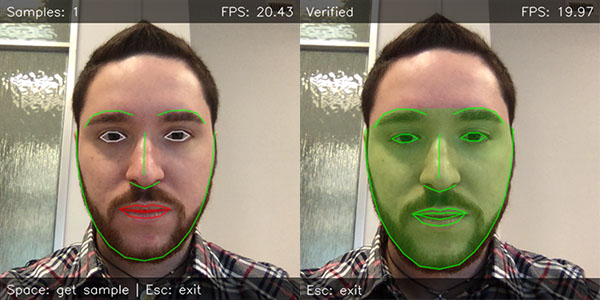

## FacePy - a Python framework for facial recognition

### Author

[Ivano Bilenchi](https://ivanobilenchi.com)

### Description

**FacePy** is a Python framework that allows you to use a number of facial recognition algorithms for both verification and identification purposes. It makes use of the [OpenCV](https://opencv.org) and [Dlib](http://dlib.net) libraries for processing and recognition tasks, and the [LFW dataset](http://vis-www.cs.umass.edu/lfw/) for training and performance evaluation.

The system has been developed as the end of year project for the *Image Processing and Computer Vision* exam.

### Prerequisites

FacePy has only been tested on **macOS 10.14 Mojave**, though it should work on earlier macOS releases as well. I believe this can also run on other platforms with zero-to-minor modifications, though multi-platform support is out of scope.

It requires a working [Python 3](https://python.org) interpreter, as well as [CMake](https://cmake.org) (which is needed to build Dlib). The easiest way to install both dependencies on macOS is via [HomeBrew](https://brew.sh). Once HomeBrew is installed:

`brew install python3 cmake`

### Installation

FacePy comes with a [setup script](setup.sh) that downloads and installs all the required dependencies. Python package dependencies are automatically installed in a fresh [venv](https://docs.python.org/3/library/venv.html) in order to avoid messing with globally installed packages.

To install FacePy:

- Clone this repository: `git clone https://github.com/IvanoBilenchi/facepy.git`
- Run the setup script: `cd facepy && ./setup.sh`
- Wait until installation ends (it may take a few minutes).

To uninstall FacePy, just delete the `facepy` dir.

### Usage

FacePy can be run interactively for verification, or in batch mode for both verification and identification (classification). You can run it by invoking the `./bin/facepy` script via terminal, which accepts a number of subcommands and flags.

To list the available subcommands, run `./bin/facepy -h`. If you need help with a specific subcommand, run `./bin/facepy <subcommand> -h`.

Here are a few usage examples to get you started.

#### Interactive (GUI) mode

Interactive usage allows you to train verifiers via the webcam, and to use trained verifiers for authentication.

- **Train a verifier:**
	- `./bin/facepy train-verifier`
	- Press `space` to acquire samples.
	- Press `enter` to train the verifier.
	- Wait until the system finishes training the verifier.
	- Press `esc` to exit.

- **Use the trained verifier:**
	- `./bin/facepy verify`
	- The detected face will be colored in green or red depending on whether the person standing in front of the webcam has been recognized.
	- Press `esc` to exit.

**Important note:** facial landmark positions are rendered on the webcam view in order to provide feedback w.r.t. the accuracy of the pose estimator, which is a critical part of the system: if the detected landmarks are inaccurate or wobbly, it means you must either:

- Get closer to the webcam.
- Move to a place with better illumination.
- Get a better webcam 😜

#### Batch (CLI) mode

Batch usage allows you to train verifiers and classifiers and to evaluate their performance via classical metrics. It is important to note that FacePy will filter the dataset by ignoring non-frontal samples: you can run `./bin/facepy info` to know how many samples the framework will really use for training and evaluation purposes.

- **Train and evaluate a verifier:**
	- Find individuals having at least 20 frontal samples in the dataset: `./bin/facepy info -m 20`
	- Train a verifier using the first 10 samples for the specified individual: `./bin/facepy train-verifier -d res/lfw/Tony_Blair -m 10`
	- Evaluate the verifier, skipping the first 10 samples (account for training set): `./bin/facepy evaluate-verifier -s 10`
	- The framework will report some classical performance statistics for the verifier (confusion matrix, accuracy, precision, recall, etc.).

- **Train and evaluate a classifier:**
	- Train a classifier for all the individuals having at least 15 frontal samples, using the first 10 for training: `./bin/facepy train-classifier -m 15 -t 10`
	- Evaluate the classifier, skipping the first 10 samples for each individual (account for training set): `./bin/facepy evaluate-classifier -s 10`
	- The framework will report per-class and average statistics. `w_avg` is a weighted average based on the amount of test samples for each individual.

#### Select a different recognition algorithm

FacePy supports five different recognition algorithms:

- *Eigenfaces*, *Fisherfaces* and *LBPH*, from the OpenCV library.
- Dlib's *CNN* recognizer (default).
- An old-school *geometric algorithm* based on Dlib's pose estimator.

You can choose a specific algorithm via the `-a` flag when training verifiers or classifiers:

`./bin/facepy train-verifier -d res/lfw/George_W_Bush -m 15 -a LBPH`

Supported values are `EIGEN`, `FISHER`, `LBPH`, `CNN` and `GEOMETRIC`.

### License

FacePy is available under the MIT license. See the [LICENSE](./LICENSE) file for more info.
